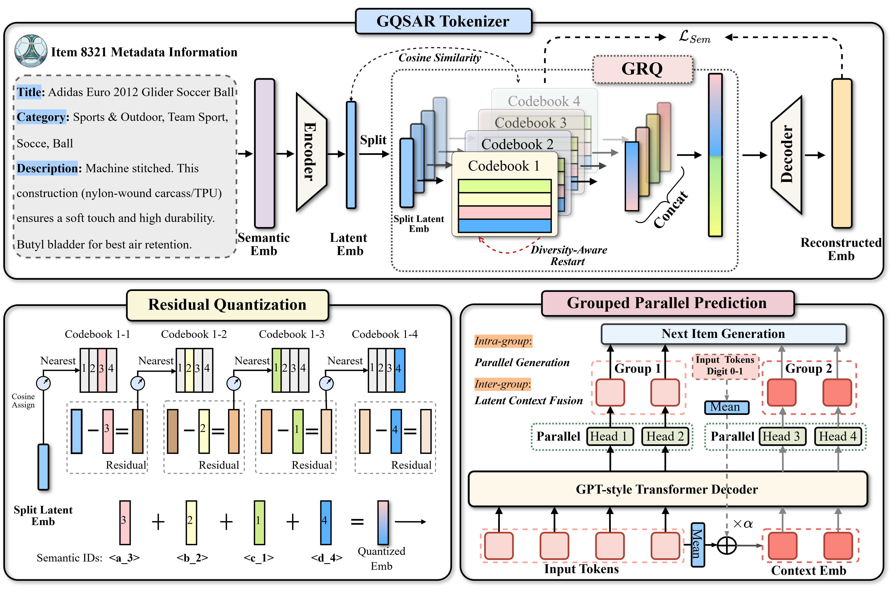

# GQSAR

This repository provides the code for _"GQSAR: Grouped Residual Quantization for Semi-Autoregressive Generative Recommendation"_.

<div align="center">

</div>

## Quick Start

Run the following command to start training the model with a specified category:

```
CUDA_VISIBLE_DEVICES=0 python main.py --category=Sports_and_Outdoors --model=GRQ
```

Available categories:
* `Sports_and_Outdoors`
* `Beauty`
* `Toys_and_Games`

Note that:
1. The datasets will be automatically downloaded once the `category` argument is specified.
2. All hyperparameters can be specified via command line arguments. Please refer to:
    * `genrec/default.yaml`
    * `genrec/datasets/AmazonReviews2014/config.yaml`
    * `genrec/models/GRQ/config.yaml`

## Reproduction

### Sports and Outdoors

```
CUDA_VISIBLE_DEVICES=0 python main.py --category=Sports_and_Outdoors --model=GRQ --context_fusion_weight=6.0
```

### Beauty

```
CUDA_VISIBLE_DEVICES=0 python main.py --category=Beauty --model=GRQ --context_fusion_weight=4.0
```

### Toys and Games

```
CUDA_VISIBLE_DEVICES=0 python main.py --category=Toys_and_Games --model=GRQ --context_fusion_weight=2.0
```
### 5. Results
You can also check the training logs in[`📁 logs`](logs/).

## Acknowledgment
Our code references [RPG](https://github.com/facebookresearch/RPG_KDD2025) and 
[RQ-VAE](https://github.com/EdoardoBotta/RQ-VAE-Recommender). We appreciate their outstanding work.
